# Themes

To download the theme just copy and paste the command below the screenshot in your CLI (Tilix Terminal).

**3024 day**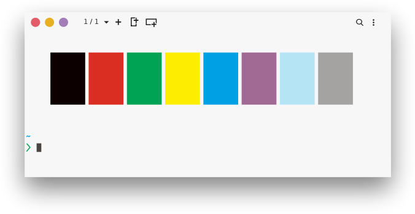 ` wget  -qO $HOME"/.config/tilix/schemes/3024-day.json" https://git.io/v7QVI ` | **3024 night**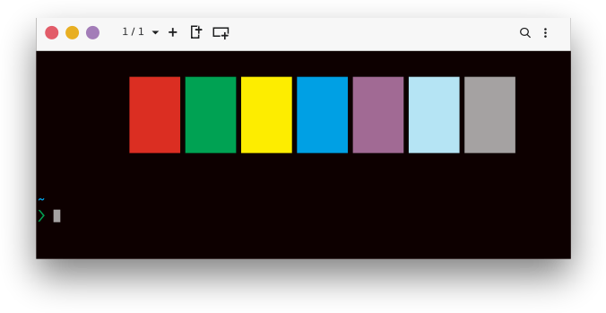 ` wget  -qO $HOME"/.config/tilix/schemes/3024-night.json" https://git.io/v7QVY ` 
:---------------------------------------------:|:----------------------------------------------:
**Adventuretime**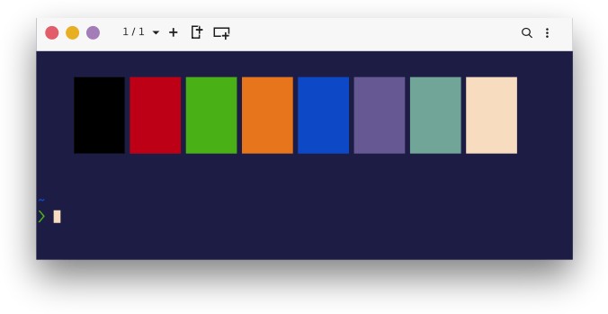 ` wget  -qO $HOME"/.config/tilix/schemes/adventuretime.json" https://git.io/v7QVg ` | **Afterglow**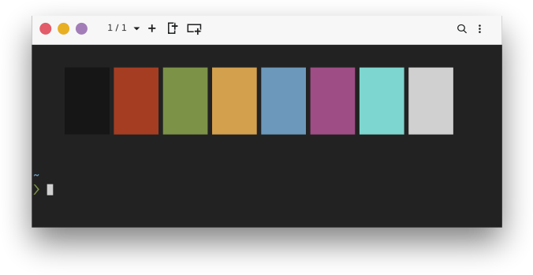 ` wget  -qO $HOME"/.config/tilix/schemes/afterglow.json" https://git.io/v7QVD ` 
**Alien blood**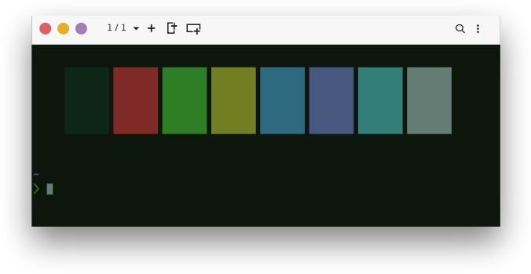 ` wget  -qO $HOME"/.config/tilix/schemes/alien-blood.json" https://git.io/v7QVk ` | **Argonaut**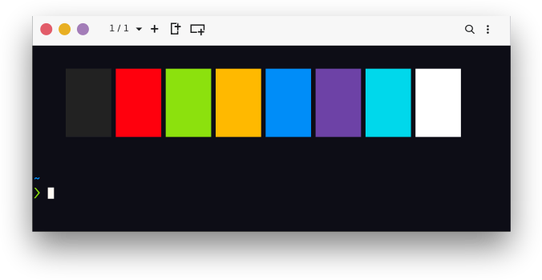 ` wget  -qO $HOME"/.config/tilix/schemes/argonaut.json" https://git.io/v7QV5 ` 
**Arthur**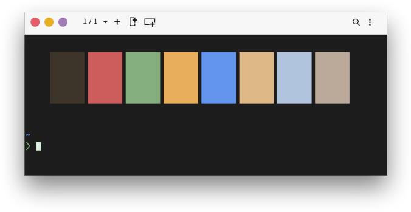 ` wget  -qO $HOME"/.config/tilix/schemes/arthur.json" https://git.io/v7QV1 ` | **Atom**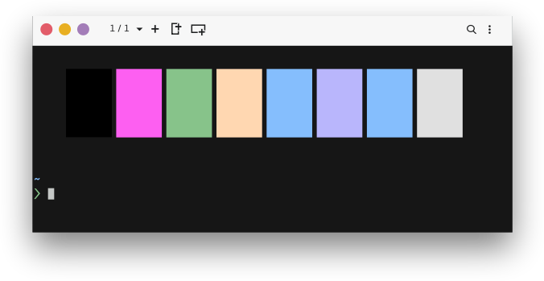 ` wget  -qO $HOME"/.config/tilix/schemes/atom.json" https://git.io/v7Q27 ` 
**Belafonte day**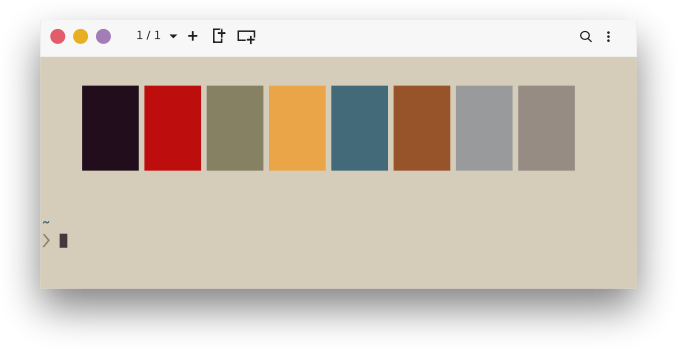 ` wget  -qO $HOME"/.config/tilix/schemes/belafonte-day.json" https://git.io/v7Q25 ` | **Belafonte night**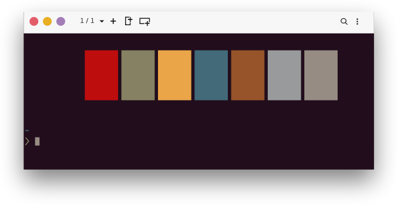 ` wget  -qO $HOME"/.config/tilix/schemes/belafonte-night.json" https://git.io/v7Q2F ` 
**Birds of paradise**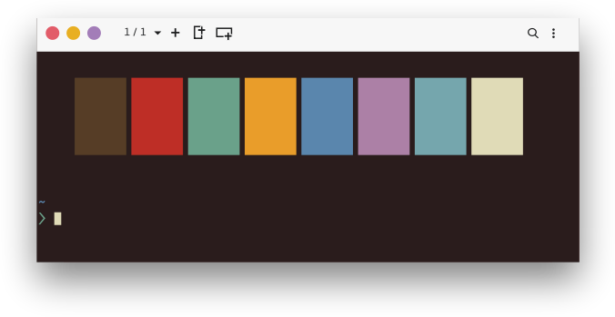 ` wget  -qO $HOME"/.config/tilix/schemes/birds-of-paradise.json" https://git.io/v7Q2x ` | **Blazer**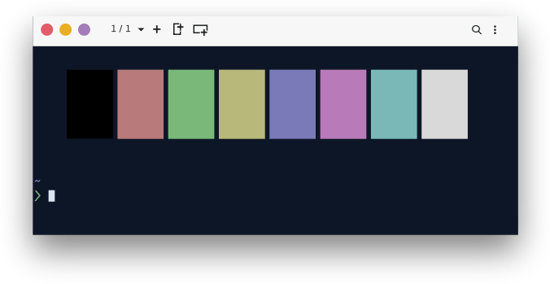 ` wget  -qO $HOME"/.config/tilix/schemes/blazer.json" https://git.io/v7Q2N ` 
**Borland**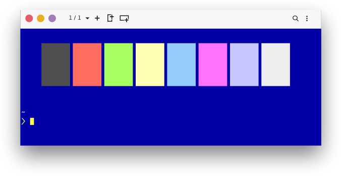 ` wget  -qO $HOME"/.config/tilix/schemes/borland.json" https://git.io/v7Q2Q ` | **Broadcast** ` wget  -qO $HOME"/.config/tilix/schemes/broadcast.json" https://git.io/v7QaU ` 
**Brogrammer**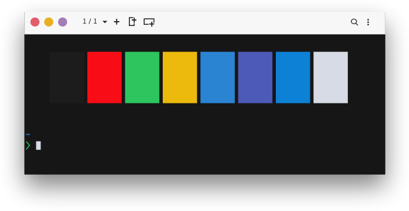 ` wget  -qO $HOME"/.config/tilix/schemes/brogrammer.json" https://git.io/v7Qa3 ` | **C64**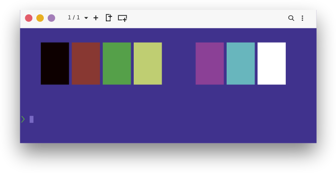 ` wget  -qO $HOME"/.config/tilix/schemes/c64.json" https://git.io/v7Q2p ` 
**Chalk**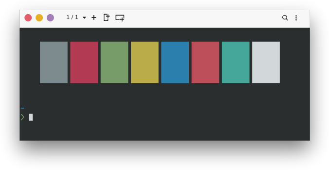 ` wget  -qO $HOME"/.config/tilix/schemes/chalk.json" https://git.io/v7Q2A ` | **Chalkboard**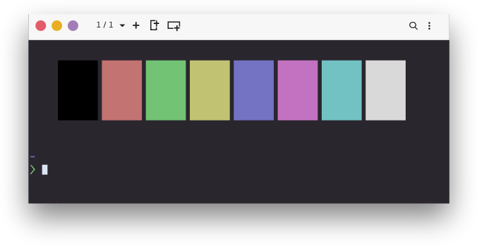 ` wget  -qO $HOME"/.config/tilix/schemes/chalkboard.json" https://git.io/v7Q2h ` 
**Ciapre**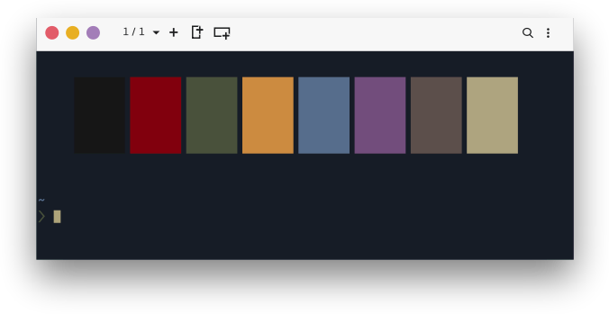 ` wget  -qO $HOME"/.config/tilix/schemes/ciapre.json" https://git.io/v7Qae ` | **Clrs**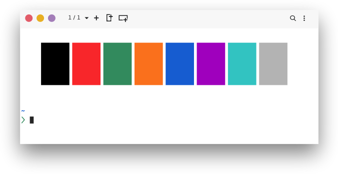 ` wget  -qO $HOME"/.config/tilix/schemes/clrs.json" https://git.io/v7QaI ` 
**Cobalt neon**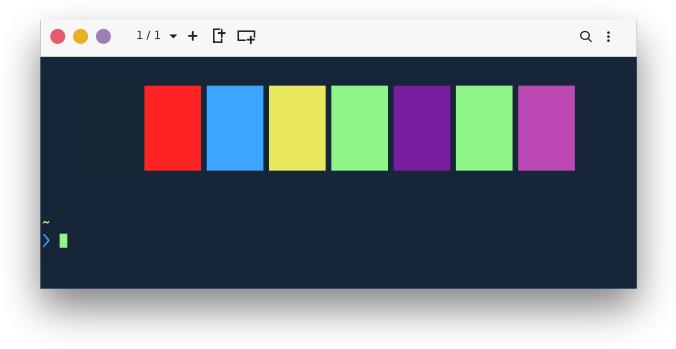 ` wget  -qO $HOME"/.config/tilix/schemes/cobalt-neon.json" https://git.io/v7Q2d ` | **Cobalt2**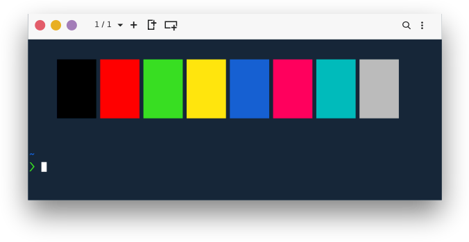 ` wget  -qO $HOME"/.config/tilix/schemes/cobalt2.json" https://git.io/v7Qav ` 
**Crayon pony fish**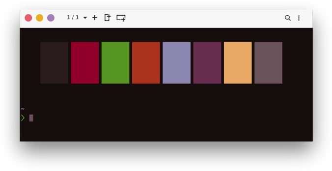 ` wget  -qO $HOME"/.config/tilix/schemes/crayon-pony-fish.json" https://git.io/v7Q2b ` | **Dark pastel**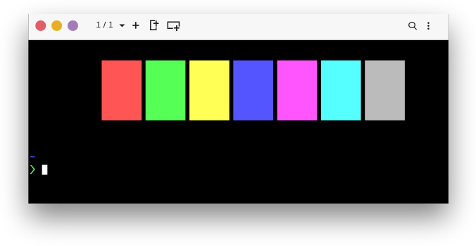 ` wget  -qO $HOME"/.config/tilix/schemes/dark-pastel.json" https://git.io/v7Q2j ` 
**Darkside**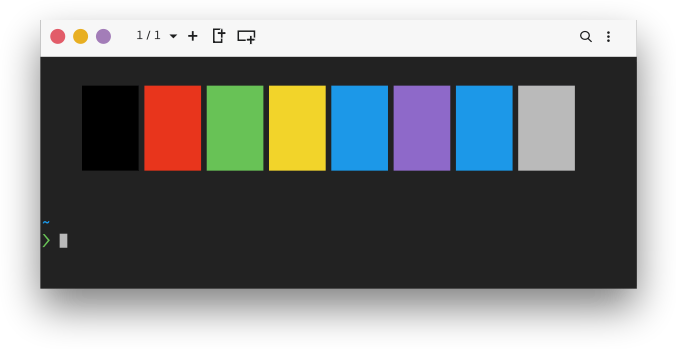 ` wget  -qO $HOME"/.config/tilix/schemes/darkside.json" https://git.io/v7QVV ` | **Desert**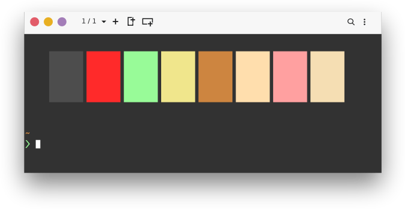 ` wget  -qO $HOME"/.config/tilix/schemes/desert.json" https://git.io/v7QVl ` 
**Dimmed monokai**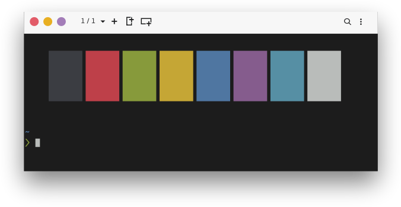 ` wget  -qO $HOME"/.config/tilix/schemes/dimmed-monokai.json" https://git.io/v7QaJ ` | **Dracula**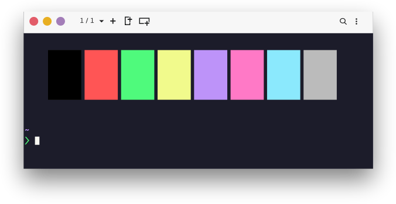 ` wget  -qO $HOME"/.config/tilix/schemes/dracula.json" https://git.io/v7QaT ` 
**Earthsong**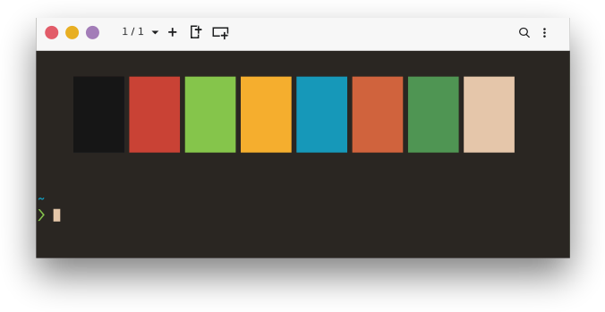 ` wget  -qO $HOME"/.config/tilix/schemes/earthsong.json" https://git.io/v7Qaf ` | **Elemental**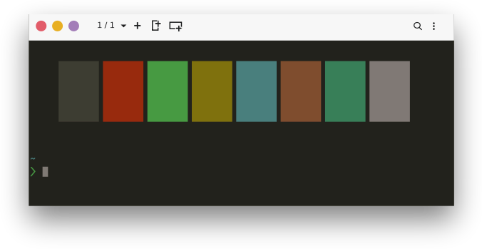 ` wget  -qO $HOME"/.config/tilix/schemes/elemental.json" https://git.io/v7Qak ` 
**Espresso libre**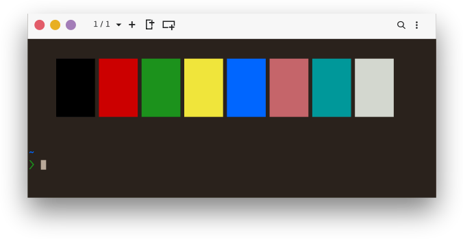 ` wget  -qO $HOME"/.config/tilix/schemes/espresso-libre.json" https://git.io/v7QaL ` | **Espresso** ` wget  -qO $HOME"/.config/tilix/schemes/espresso.json" https://git.io/v7Qam ` 
**Fishtank**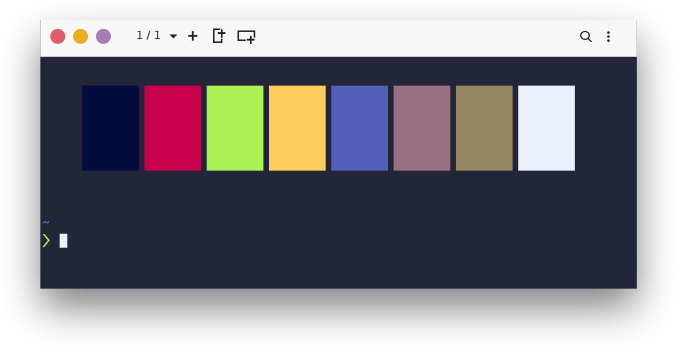 ` wget  -qO $HOME"/.config/tilix/schemes/fishtank.json" https://git.io/v7Qaq ` | **Flat** ` wget  -qO $HOME"/.config/tilix/schemes/flat.json" https://git.io/v7Qat ` 
**Flatland**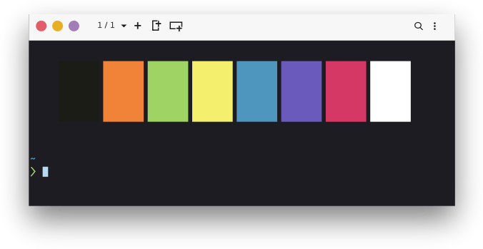 ` wget  -qO $HOME"/.config/tilix/schemes/flatland.json" https://git.io/v7Qan ` | **Frontend delight**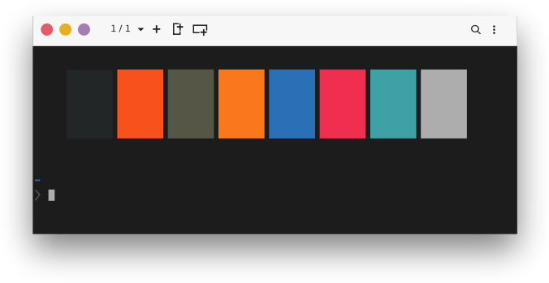 ` wget  -qO $HOME"/.config/tilix/schemes/frontend-delight.json" https://git.io/v7Qac ` 
**Frontend fun forrest**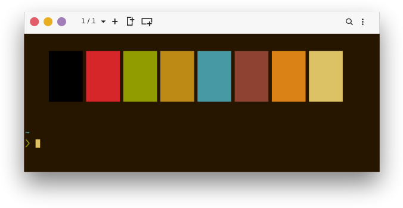 ` wget  -qO $HOME"/.config/tilix/schemes/frontend-fun-forrest.json" https://git.io/v7QVt ` | **Frontend galaxy**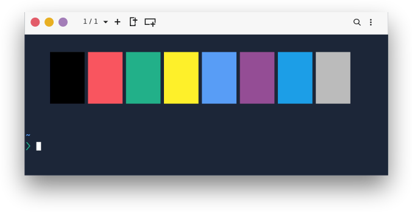 ` wget  -qO $HOME"/.config/tilix/schemes/frontend-galaxy.json" https://git.io/v7QVz ` 
**Github**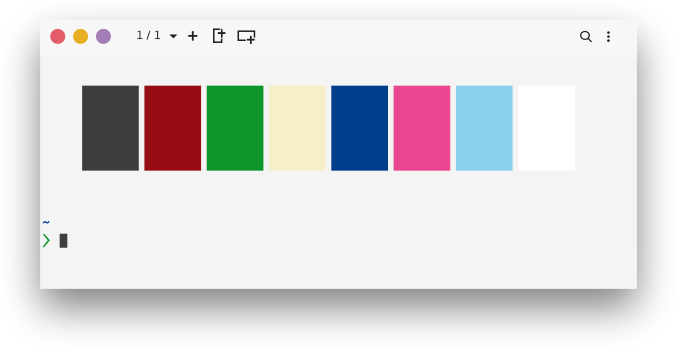 ` wget  -qO $HOME"/.config/tilix/schemes/github.json" https://git.io/v7QaC ` | **Grape**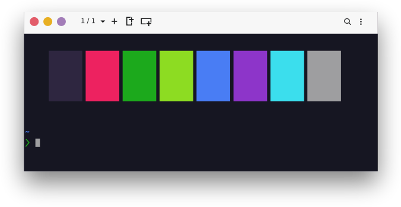 ` wget  -qO $HOME"/.config/tilix/schemes/grape.json" https://git.io/v7QaO ` 
**Grass** ` wget  -qO $HOME"/.config/tilix/schemes/grass.json" https://git.io/v7QaZ ` | **Gruvbox**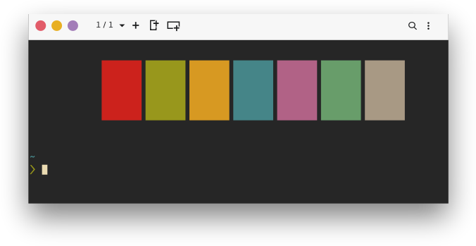 ` wget  -qO $HOME"/.config/tilix/schemes/gruvbox.json" https://git.io/v7Qas ` 
**Hardcore**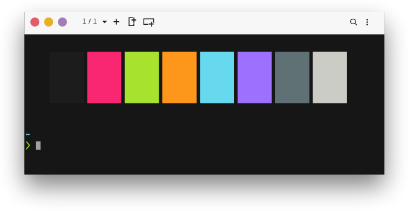 ` wget  -qO $HOME"/.config/tilix/schemes/hardcore.json" https://git.io/v7QaY ` | **Harper**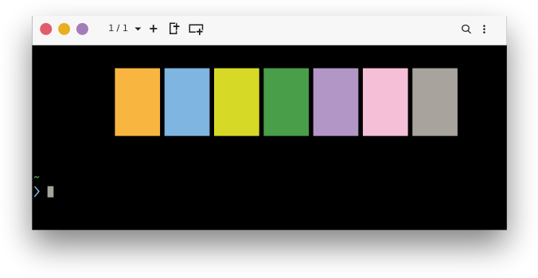 ` wget  -qO $HOME"/.config/tilix/schemes/harper.json" https://git.io/v7QaG ` 
**Highway**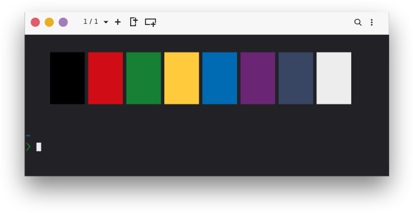 ` wget  -qO $HOME"/.config/tilix/schemes/highway.json" https://git.io/v7QV7 ` | **Hipster green**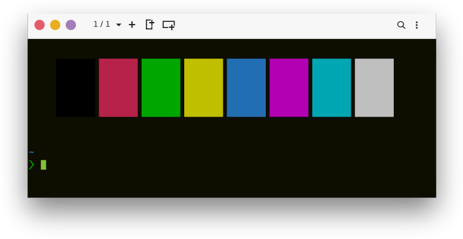 ` wget  -qO $HOME"/.config/tilix/schemes/hipster-green.json" https://git.io/v7QaW ` 
**Homebrew**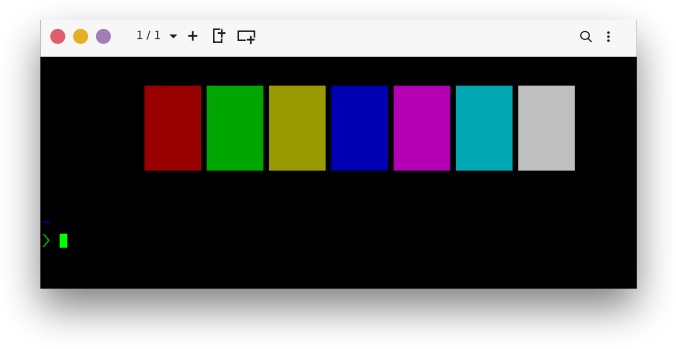 ` wget  -qO $HOME"/.config/tilix/schemes/homebrew.json" https://git.io/v7Qa4 ` | **Hurtado**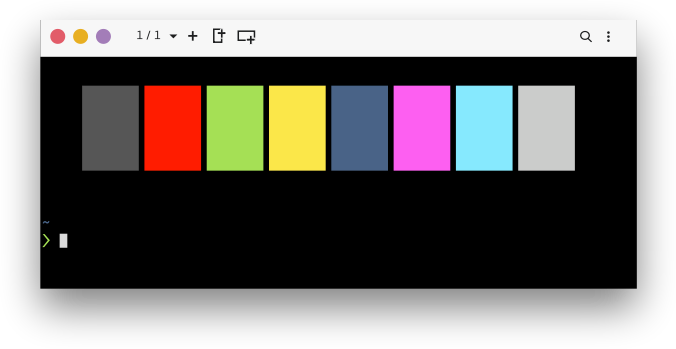 ` wget  -qO $HOME"/.config/tilix/schemes/hurtado.json" https://git.io/v7QaB ` 
**Hybrid**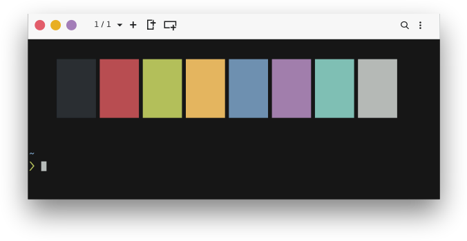 ` wget  -qO $HOME"/.config/tilix/schemes/hybrid.json" https://git.io/v7Qal ` | **Ic green ppl**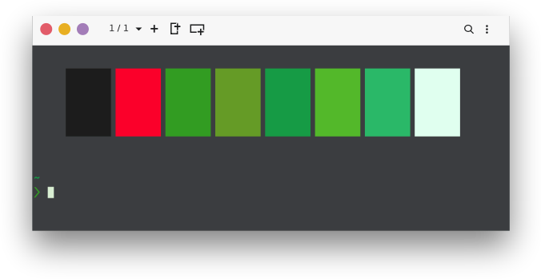 ` wget  -qO $HOME"/.config/tilix/schemes/ic-green-ppl.json" https://git.io/v7QaR ` 
**Ic orange ppl**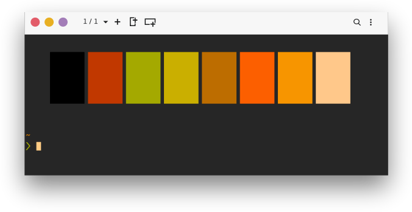 ` wget  -qO $HOME"/.config/tilix/schemes/ic-orange-ppl.json" https://git.io/v7Qa0 ` | **Idle toes**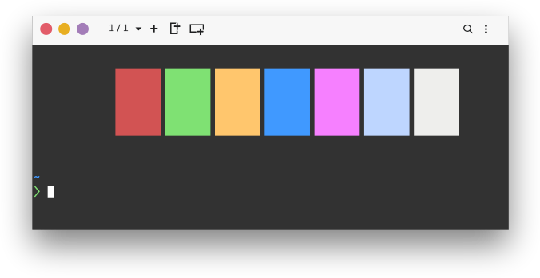 ` wget  -qO $HOME"/.config/tilix/schemes/idle-toes.json" https://git.io/v7QVw ` 
**Ir black**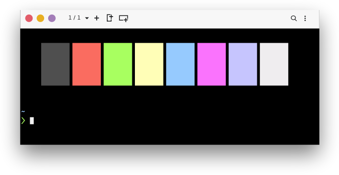 ` wget  -qO $HOME"/.config/tilix/schemes/ir-black.json" https://git.io/v7Qa8 ` | **Jackie brown**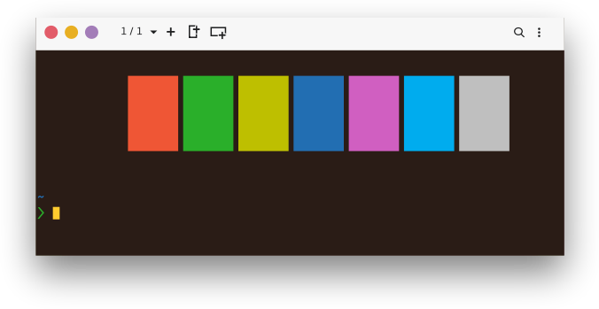 ` wget  -qO $HOME"/.config/tilix/schemes/jackie-brown.json" https://git.io/v7Qau ` 
**Japanesque**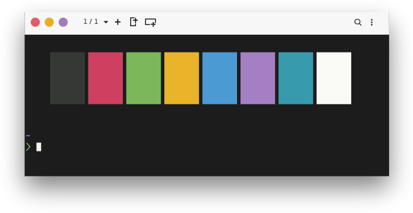 ` wget  -qO $HOME"/.config/tilix/schemes/japanesque.json" https://git.io/v7QaE ` | **Jellybeans**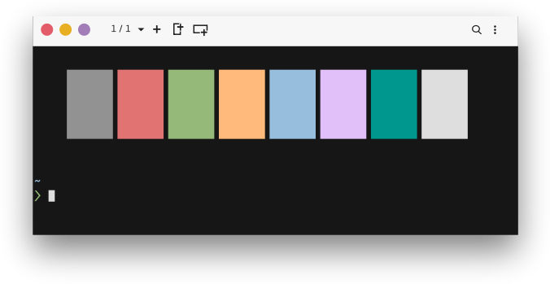 ` wget  -qO $HOME"/.config/tilix/schemes/jellybeans.json" https://git.io/v7Qaz ` 
**Kibble**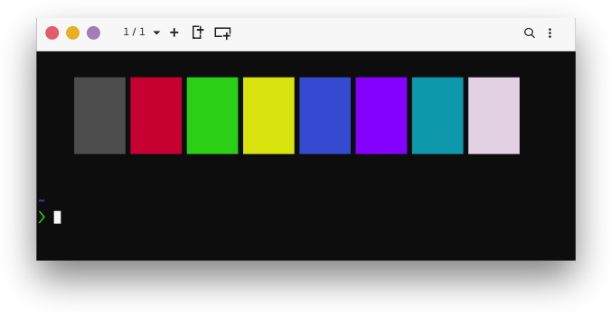 ` wget  -qO $HOME"/.config/tilix/schemes/kibble.json" https://git.io/v7Qag ` | **Later this evening**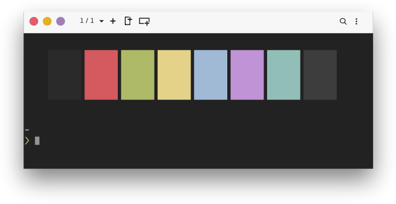 ` wget  -qO $HOME"/.config/tilix/schemes/later-this-evening.json" https://git.io/v7Qa2 ` 
**Lavandula**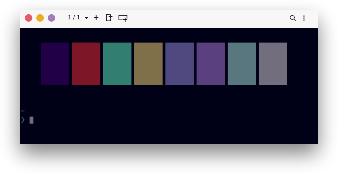 ` wget  -qO $HOME"/.config/tilix/schemes/lavandula.json" https://git.io/v7QVL ` | **Liquid carbon transparent**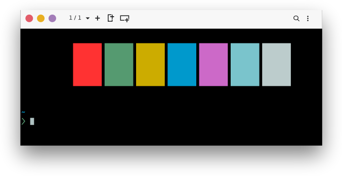 ` wget  -qO $HOME"/.config/tilix/schemes/liquid-carbon-transparent.json" https://git.io/v7QaV ` 
**Liquid carbon**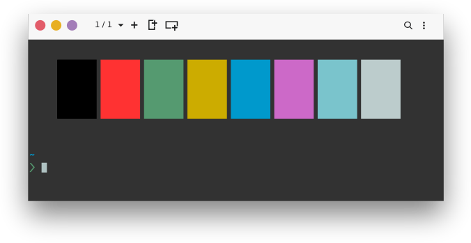 ` wget  -qO $HOME"/.config/tilix/schemes/liquid-carbon.json" https://git.io/v7Qaa ` | **Man page**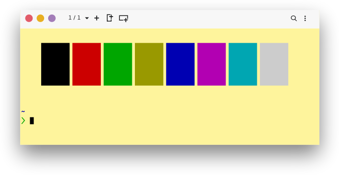 ` wget  -qO $HOME"/.config/tilix/schemes/man-page.json" https://git.io/v7QVU ` 
**Mathias**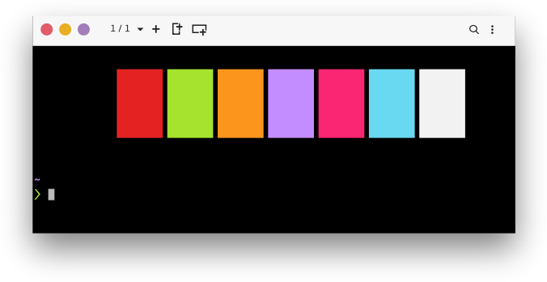 ` wget  -qO $HOME"/.config/tilix/schemes/mathias.json" https://git.io/v7Q0x ` | **Medallion**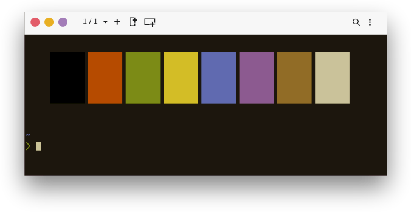 ` wget  -qO $HOME"/.config/tilix/schemes/medallion.json" https://git.io/v7QaM ` 
**Misterioso**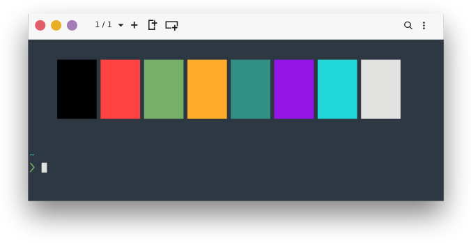 ` wget  -qO $HOME"/.config/tilix/schemes/misterioso.json" https://git.io/v7Qa6 ` | **Molokai**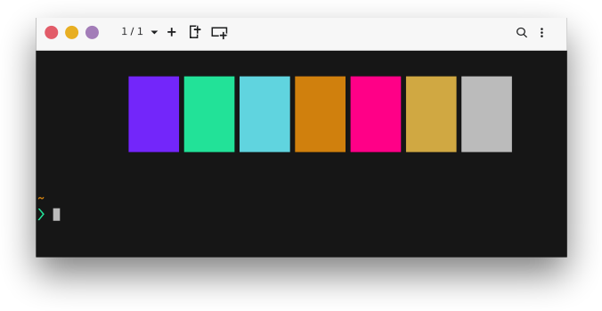 ` wget  -qO $HOME"/.config/tilix/schemes/molokai.json" https://git.io/v7QVE ` 
**Monalisa**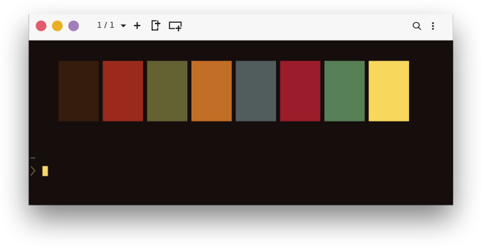 ` wget  -qO $HOME"/.config/tilix/schemes/monalisa.json" https://git.io/v7QV2 ` | **Monokai soda**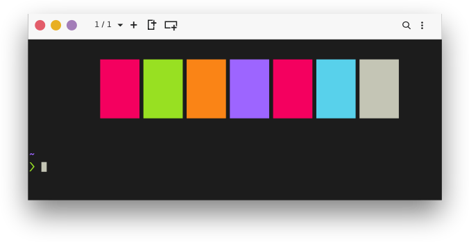 ` wget  -qO $HOME"/.config/tilix/schemes/monokai-soda.json" https://git.io/v7Qao ` 
**Monokai**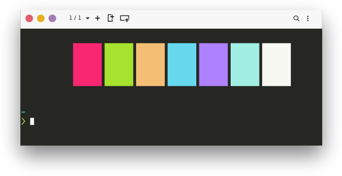 ` wget  -qO $HOME"/.config/tilix/schemes/monokai.json" https://git.io/v7Qad ` | **N0tch2k**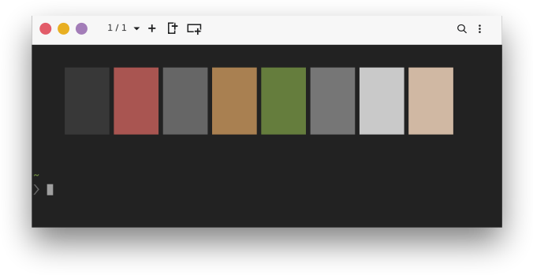 ` wget  -qO $HOME"/.config/tilix/schemes/n0tch2k.json" https://git.io/v7QaD ` 
**Neopolitan**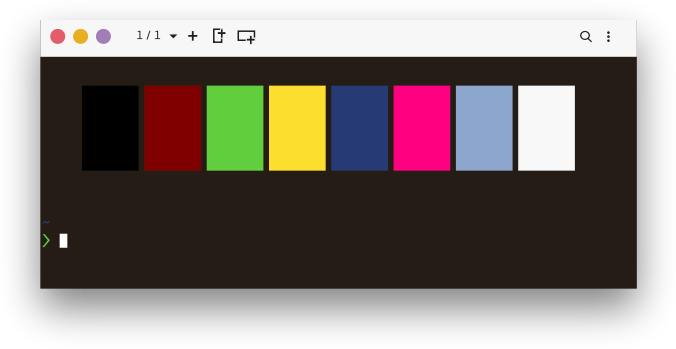 ` wget  -qO $HOME"/.config/tilix/schemes/neopolitan.json" https://git.io/v7QaQ ` | **Neutron**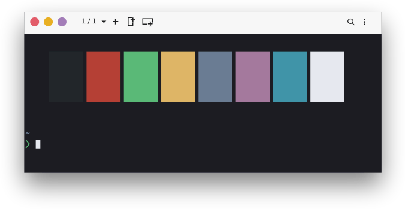 ` wget  -qO $HOME"/.config/tilix/schemes/neutron.json" https://git.io/v7QVv ` 
**Nightlion v1**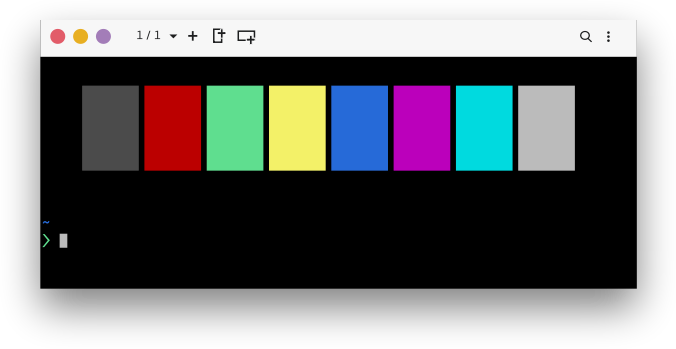 ` wget  -qO $HOME"/.config/tilix/schemes/nightlion-v1.json" https://git.io/v7Qaj ` | **Nightlion v2**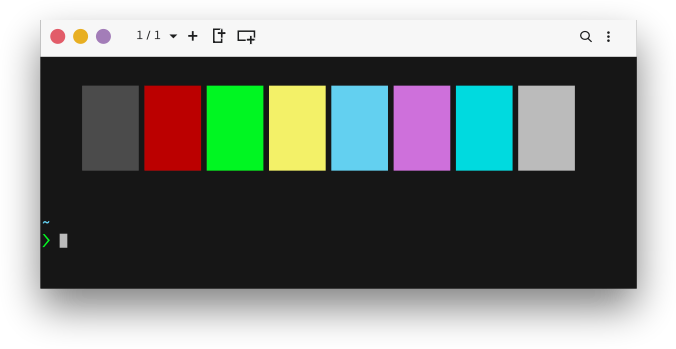 ` wget  -qO $HOME"/.config/tilix/schemes/nightlion-v2.json" https://git.io/v7QVa ` 
**Novel**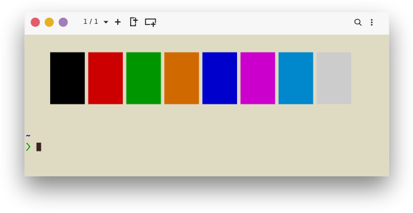 ` wget  -qO $HOME"/.config/tilix/schemes/novel.json" https://git.io/v7QVu ` | **Obsidian**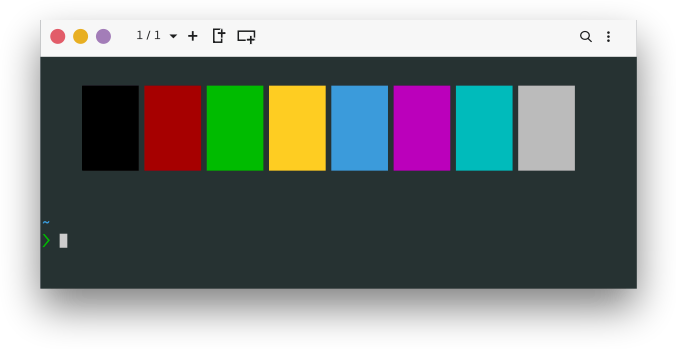 ` wget  -qO $HOME"/.config/tilix/schemes/obsidian.json" https://git.io/v7QV8 ` 
**Ocean**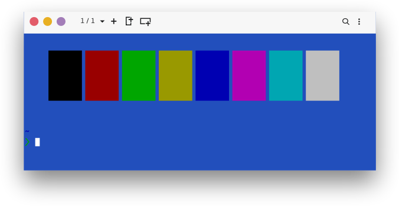 ` wget  -qO $HOME"/.config/tilix/schemes/ocean.json" https://git.io/v7QaX ` | **Oceanic next**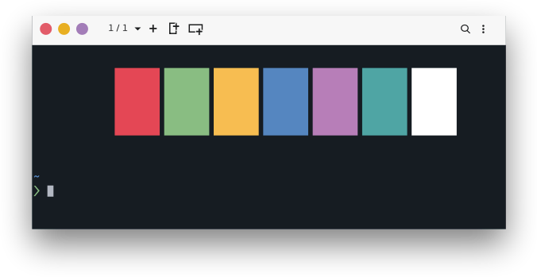 ` wget  -qO $HOME"/.config/tilix/schemes/oceanic-next.json" https://git.io/v7QaA ` 
**Ollie**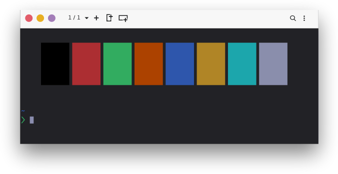 ` wget  -qO $HOME"/.config/tilix/schemes/ollie.json" https://git.io/v7Qap ` | **One dark**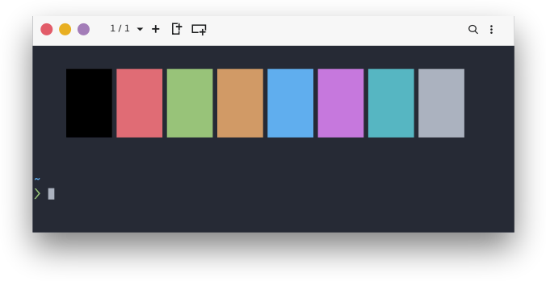 ` wget  -qO $HOME"/.config/tilix/schemes/one-dark.json" https://git.io/v7Qaw ` 
**Paraiso dark**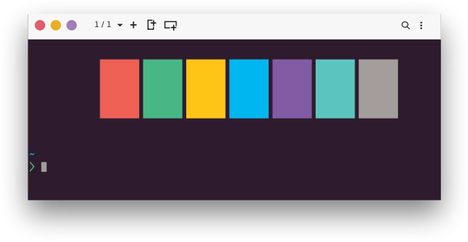 ` wget  -qO $HOME"/.config/tilix/schemes/paraiso-dark.json" https://git.io/v7Qa1 ` | **Paul millr**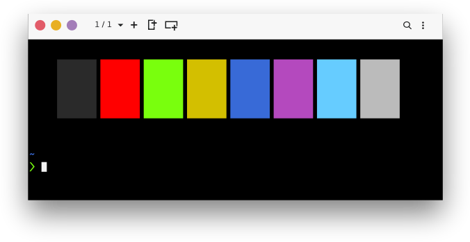 ` wget  -qO $HOME"/.config/tilix/schemes/paul-millr.json" https://git.io/v7QaN ` 
**Pencil dark**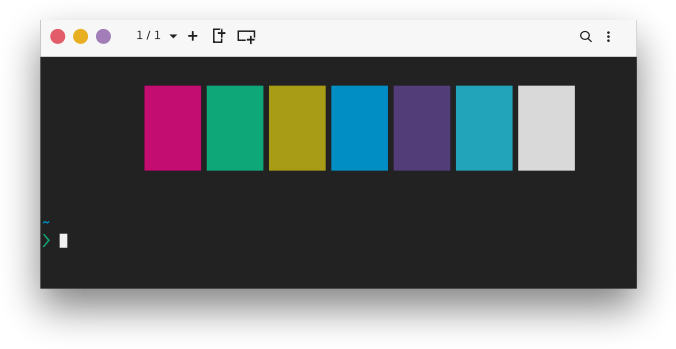 ` wget  -qO $HOME"/.config/tilix/schemes/pencil-dark.json" https://git.io/v7Qab ` | **Pencil light**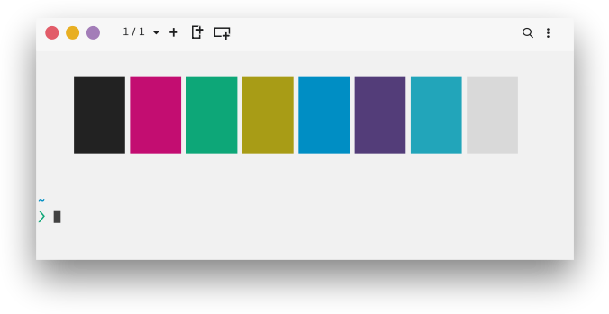 ` wget  -qO $HOME"/.config/tilix/schemes/pencil-light.json" https://git.io/v7QVJ ` 
**Pnevma**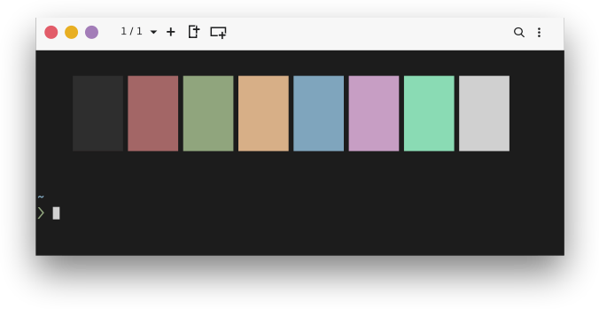 ` wget  -qO $HOME"/.config/tilix/schemes/pnevma.json" https://git.io/v7QV0 ` | **Pro**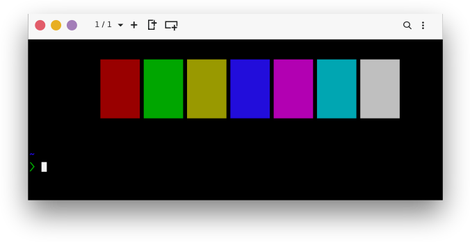 ` wget  -qO $HOME"/.config/tilix/schemes/pro.json" https://git.io/v7QaF ` 
**Red alert**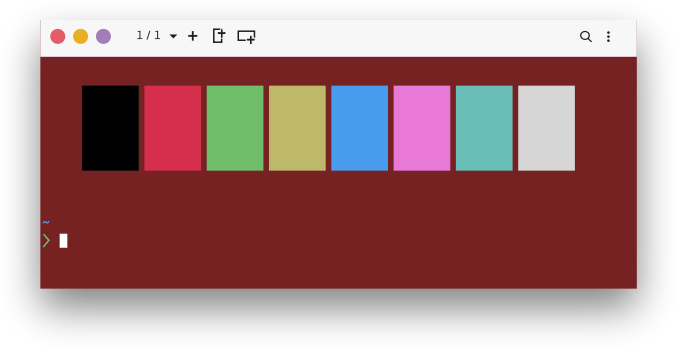 ` wget  -qO $HOME"/.config/tilix/schemes/red-alert.json" https://git.io/v7Qa7 ` | **Red sands**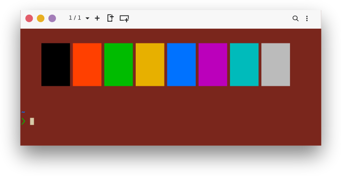 ` wget  -qO $HOME"/.config/tilix/schemes/red-sands.json" https://git.io/v7QVf ` 
**Rippedcasts**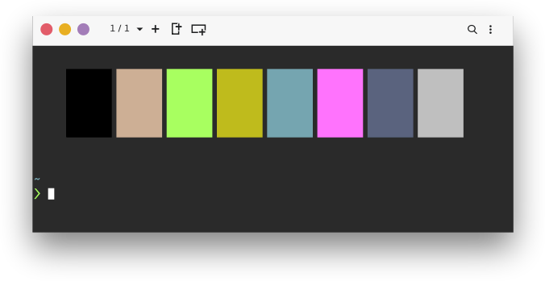 ` wget  -qO $HOME"/.config/tilix/schemes/rippedcasts.json" https://git.io/v7QaP ` | **Royal**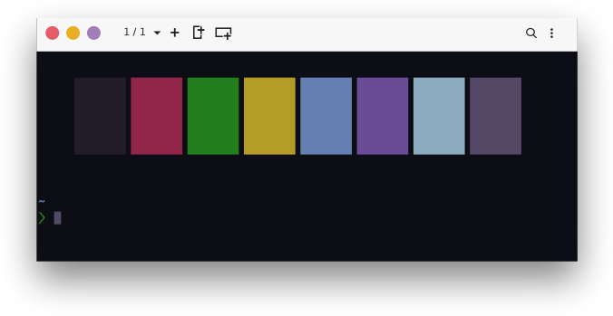 ` wget  -qO $HOME"/.config/tilix/schemes/royal.json" https://git.io/v7Qah ` 
**Sea shells**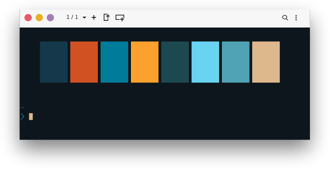 ` wget  -qO $HOME"/.config/tilix/schemes/sea-shells.json" https://git.io/v7Qay ` | **Seafoam pastel**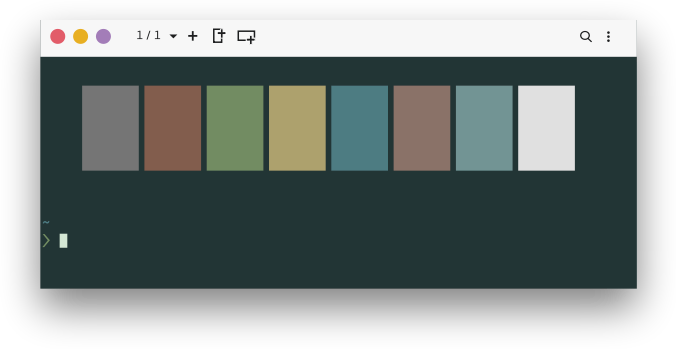 ` wget  -qO $HOME"/.config/tilix/schemes/seafoam-pastel.json" https://git.io/v7QVW ` 
**Seti**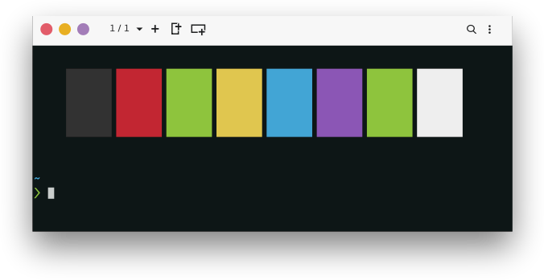 ` wget  -qO $HOME"/.config/tilix/schemes/seti.json" https://git.io/v7QV4 ` | **Shaman**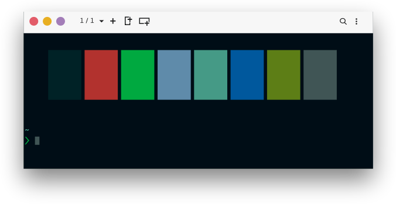 ` wget  -qO $HOME"/.config/tilix/schemes/shaman.json" https://git.io/v7QaH ` 
**Slate**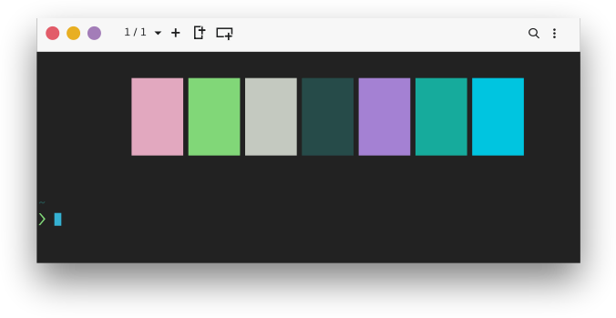 ` wget  -qO $HOME"/.config/tilix/schemes/slate.json" https://git.io/v7Qax ` | **Smyck**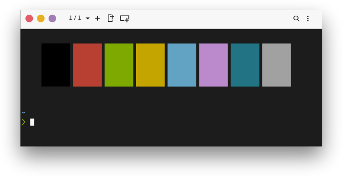 ` wget  -qO $HOME"/.config/tilix/schemes/smyck.json" https://git.io/v7QVe ` 
**Soft server**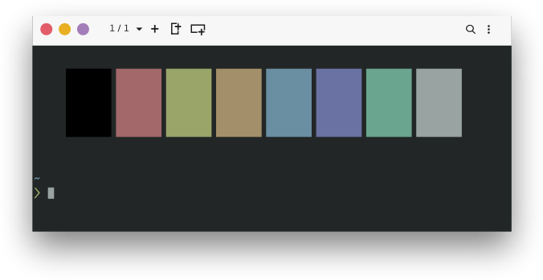 ` wget  -qO $HOME"/.config/tilix/schemes/soft-server.json" https://git.io/v7QaS ` | **Solarized darcula**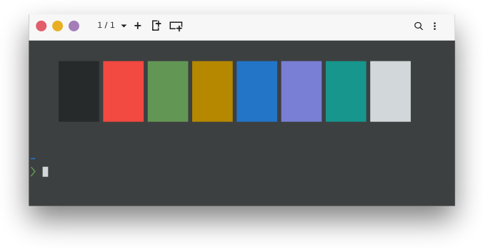 ` wget  -qO $HOME"/.config/tilix/schemes/solarized-darcula.json" https://git.io/v7Qa9 ` 
**Solarized dark higher contrast**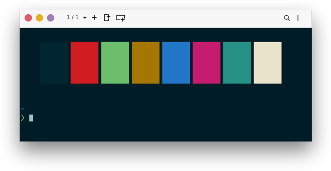 ` wget  -qO $HOME"/.config/tilix/schemes/solarized-dark-higher-contrast.json" https://git.io/v7Qa5 ` | **Spacedust**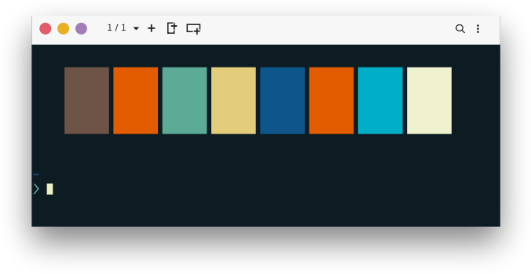 ` wget  -qO $HOME"/.config/tilix/schemes/spacedust.json" https://git.io/v7Qai ` 
**Spacegray eighties dull**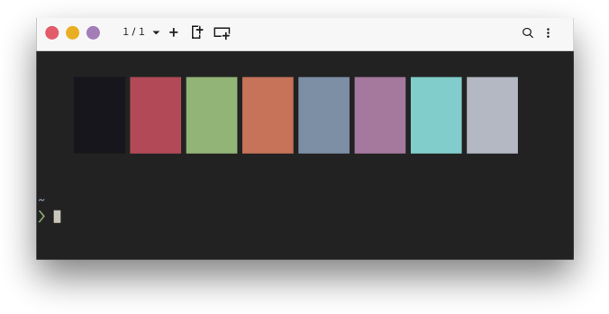 ` wget  -qO $HOME"/.config/tilix/schemes/spacegray-eighties-dull.json" https://git.io/v7Qar ` | **Spacegray eighties** ` wget  -qO $HOME"/.config/tilix/schemes/spacegray-eighties.json" https://git.io/v7QVB ` 
**Spacegray**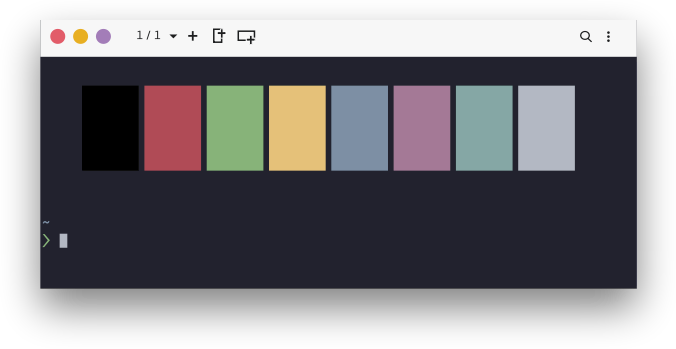 ` wget  -qO $HOME"/.config/tilix/schemes/spacegray.json" https://git.io/v7QV3 ` | **Spring**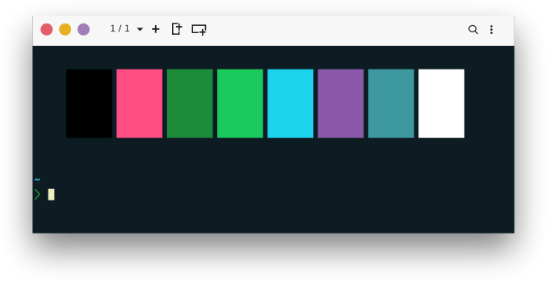 ` wget  -qO $HOME"/.config/tilix/schemes/spring.json" https://git.io/v7QVn ` 
**Square**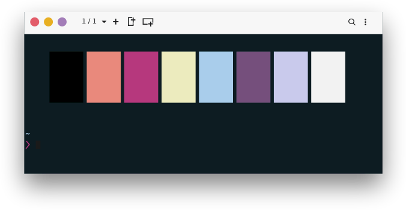 ` wget  -qO $HOME"/.config/tilix/schemes/square.json" https://git.io/v7QVm ` | **Sundried**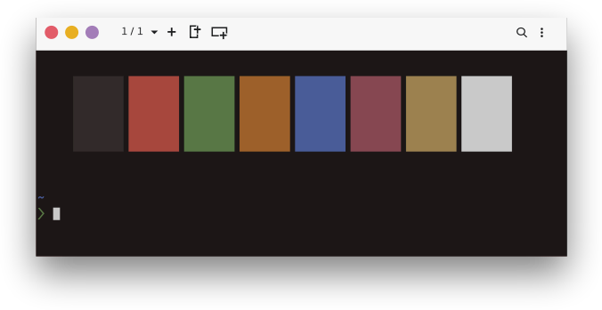 ` wget  -qO $HOME"/.config/tilix/schemes/sundried.json" https://git.io/v7QVO ` 
**Symphonic**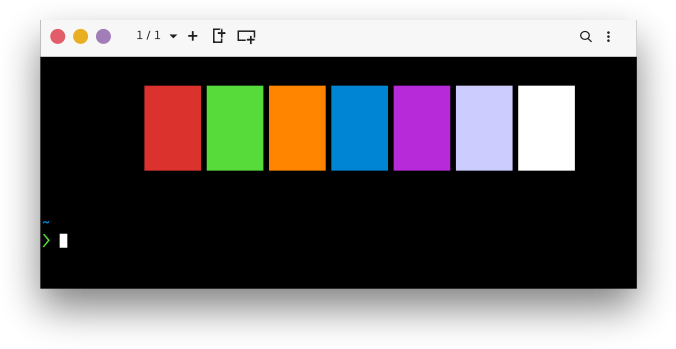 ` wget  -qO $HOME"/.config/tilix/schemes/symphonic.json" https://git.io/v7QVT ` | **Teerb**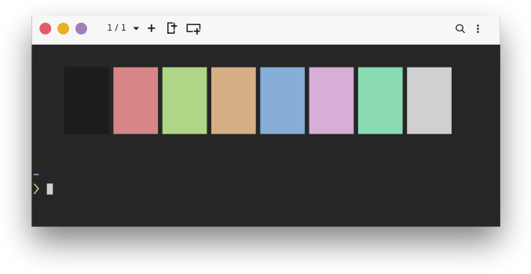 ` wget  -qO $HOME"/.config/tilix/schemes/teerb.json" https://git.io/v7QVs ` 
**Terminal basic**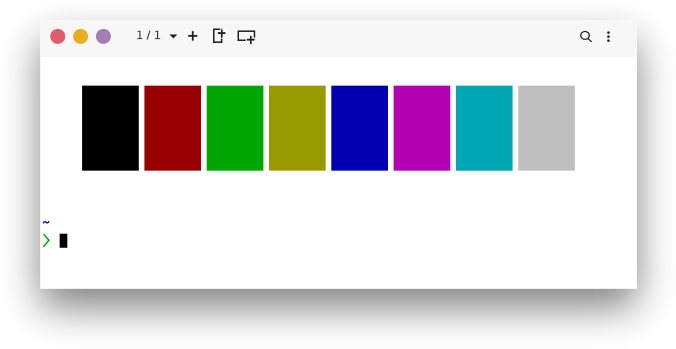 ` wget  -qO $HOME"/.config/tilix/schemes/terminal-basic.json" https://git.io/v7QVP ` | **Terminix dark**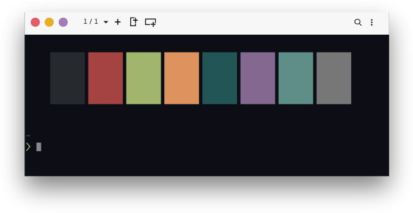 ` wget  -qO $HOME"/.config/tilix/schemes/terminix-dark.json" https://git.io/v7QaK ` 
**Terminix dark** ` wget  -qO $HOME"/.config/tilix/schemes/terminix-dark.json" https://git.io/v7QaK ` | **Thayer bright**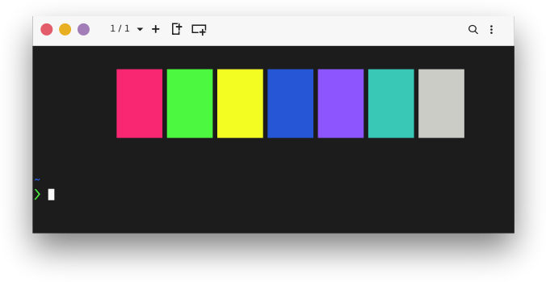 ` wget  -qO $HOME"/.config/tilix/schemes/thayer-bright.json" https://git.io/v7QVZ ` 
**Tommorow night** ` wget  -qO $HOME"/.config/tilix/schemes/tommorow-night.json" https://git.io/v7QVG ` | **Tomorrow night blue** ` wget  -qO $HOME"/.config/tilix/schemes/tomorrow-night-blue.json" https://git.io/v7QVr ` 
**Tomorrow night bright**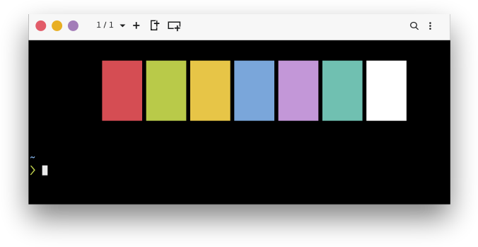 ` wget  -qO $HOME"/.config/tilix/schemes/tomorrow-night-bright.json" https://git.io/v7QVq ` | **Tomorrow night eighties**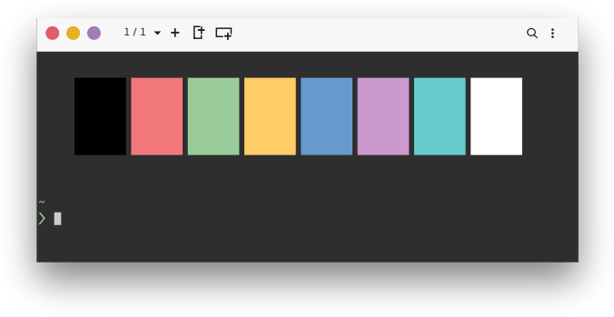 ` wget  -qO $HOME"/.config/tilix/schemes/tomorrow-night-eighties.json" https://git.io/v7QV6 ` 
**Tomorrow**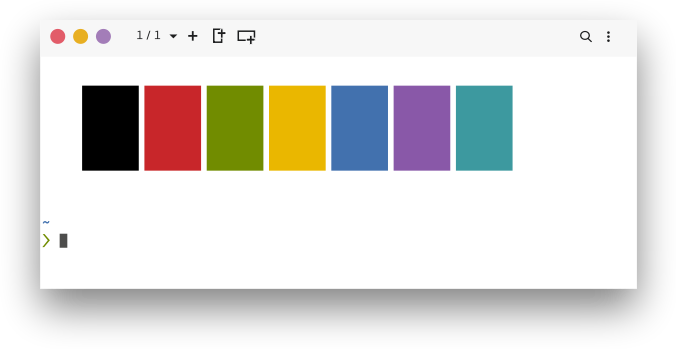 ` wget  -qO $HOME"/.config/tilix/schemes/tomorrow.json" https://git.io/v7QVy ` | **Toy chest**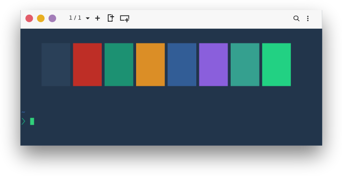 ` wget  -qO $HOME"/.config/tilix/schemes/toy-chest.json" https://git.io/v7QVC ` 
**Treehouse**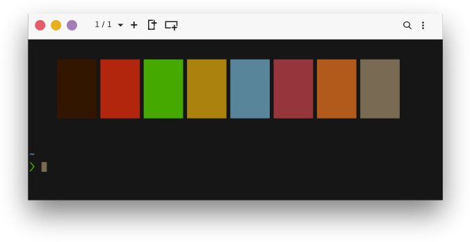 ` wget  -qO $HOME"/.config/tilix/schemes/treehouse.json" https://git.io/v7QVQ ` | **Twilight**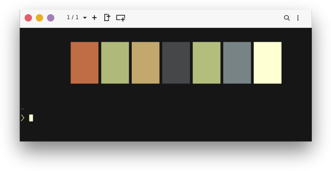 ` wget  -qO $HOME"/.config/tilix/schemes/twilight.json" https://git.io/v7QVH ` 
**Urple**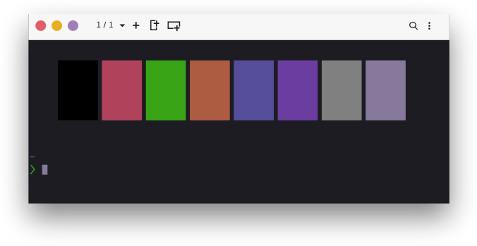 ` wget  -qO $HOME"/.config/tilix/schemes/urple.json" https://git.io/v7QV9 ` | **Vaughn**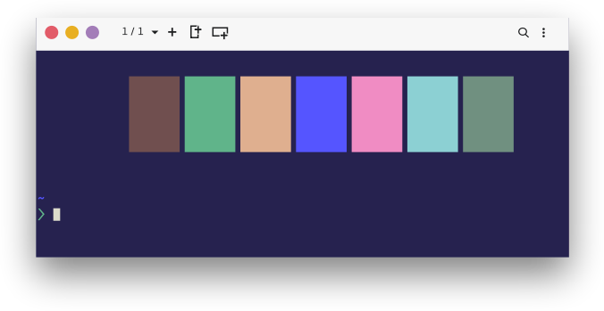 ` wget  -qO $HOME"/.config/tilix/schemes/vaughn.json" https://git.io/v7QVi ` 
**Vibrant ink**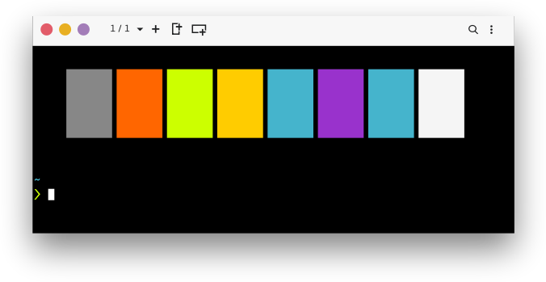 ` wget  -qO $HOME"/.config/tilix/schemes/vibrant-ink.json" https://git.io/v7QVX ` | **Warm neon**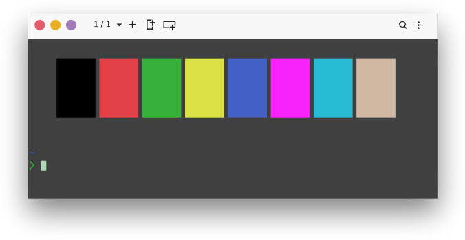 ` wget  -qO $HOME"/.config/tilix/schemes/warm-neon.json" https://git.io/v7QVc ` 
**Wez** ` wget  -qO $HOME"/.config/tilix/schemes/wez.json" https://git.io/v7QVM ` | **Wild cherry**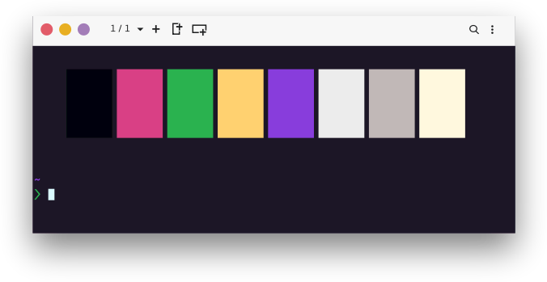 ` wget  -qO $HOME"/.config/tilix/schemes/wild-cherry.json" https://git.io/v7QVS ` 
**Wombat**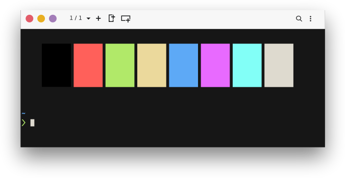 ` wget  -qO $HOME"/.config/tilix/schemes/wombat.json" https://git.io/v7QVR ` | **Wryan**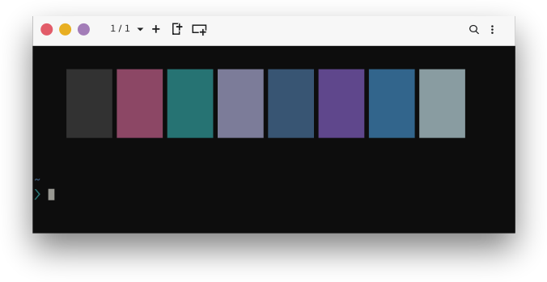 ` wget  -qO $HOME"/.config/tilix/schemes/wryan.json" https://git.io/v7QVo ` 
**Zenburn**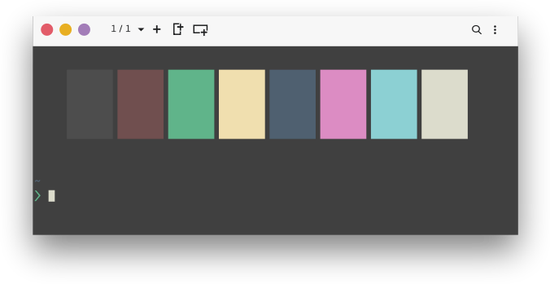 ` wget  -qO $HOME"/.config/tilix/schemes/zenburn.json" https://git.io/v7QVd ` | 

[⬆ Back to top](#themes)
